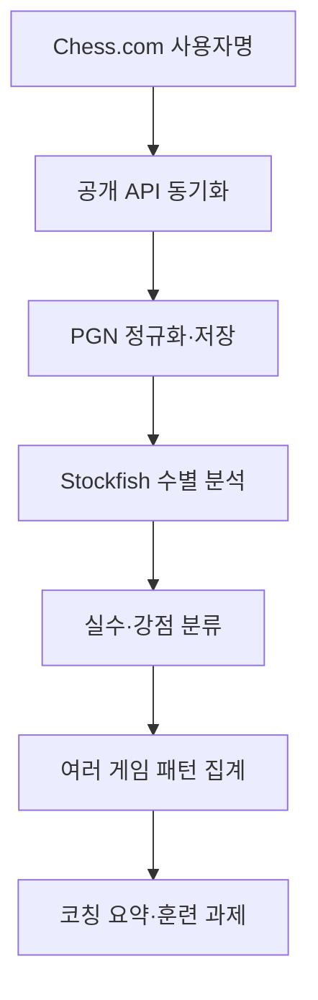

# 개인 체스 코치 앱 개발 가이드

기준일: 2026-08-30  
개발 도구: Claude Code  
초기 운영 형태: macOS 로컬 단일 사용자 웹앱

## 1. 제품 정의

### 1.1 한 문장 정의

Chess.com의 내 게임을 자동으로 수집하고 Stockfish로 분석한 뒤, 개별 게임의 승패 원인과 여러 게임에서 반복되는 강점·약점·훈련 과제를 한국어로 설명하는 개인 체스 코치 앱.

### 1.2 이 앱이 해결할 문제

- 매번 PGN을 내려받아 분석 도구에 넣는 번거로움
- 엔진의 숫자와 최선수를 봐도 왜 그 수가 문제인지 이해하기 어려운 문제
- 한 게임의 블런더는 알 수 있지만 여러 게임에 반복되는 습관을 알기 어려운 문제
- 무엇을 얼마나 연습해야 하는지 우선순위가 없는 문제

### 1.3 제품 원칙

1. **결과보다 원인 중심**: “17수째 블런더”에서 끝내지 않고, 후보수 확인 부족·상대 위협 누락·전술 패턴 미인식 등 원인으로 분류
2. **개별 게임보다 반복 패턴 중심**: 최소 10판 이상에서 반복된 현상만 개인 성향으로 판단
3. **실행 가능한 처방**: 분석 결과마다 다음 게임 체크포인트와 1주 훈련 과제 제시
4. **엔진과 코치의 역할 분리**: Stockfish는 수의 객관적 품질을 계산하고, 코칭 계층은 사람이 이해할 수 있는 설명과 훈련 우선순위를 생성
5. **로컬 우선**: 게임 기록과 분석 결과를 사용자의 Mac에 저장. 외부 LLM 전송은 명시적으로 켠 경우에만 허용

## 2. 개발 범위

### 2.1 MVP에서 반드시 구현할 기능

#### A. 선수 등록 및 게임 동기화

- Chess.com 사용자명 등록
- 선수 프로필과 래피드·블리츠·불릿 레이팅 표시
- 최근 1개월 또는 최근 N판 동기화
- 게임 URL을 기준으로 중복 저장 방지
- 동기화 시 게임 종류, 색상, 결과, 상대, 레이팅, 시간 형식, PGN, 종료 시각 저장
- Chess.com API 요청은 직렬 처리하고 식별 가능한 `User-Agent` 사용

#### B. 게임 목록

- 기간, 승패, 백/흑, 시간 형식, 분석 여부 필터
- 각 게임의 상대, 결과, 레이팅 차이, 오프닝, 정확도(제공된 경우) 표시
- 미분석 게임 일괄 분석

#### C. 단일 게임 분석

- 수를 앞뒤로 이동할 수 있는 체스보드
- 실제 수, Stockfish 추천 수, 수를 두기 전후의 평가값 표시
- 형이 둔 수만 품질 판정
- 승패를 가른 핵심 장면 최대 3개 선별
- 잘한 장면 최대 3개 선별
- 게임 요약: 오프닝, 미들게임, 엔드게임, 시간 사용, 결정적 원인
- 사용자가 직접 “당시 생각”과 “복기 메모” 입력

#### D. 누적 코칭 대시보드

- 최근 10·30·90판 성적
- 백/흑 및 시간 형식별 성적
- 자주 둔 오프닝과 성적
- 평균 평가 손실과 중대 실수 빈도
- 반복 약점 상위 3개와 근거 게임
- 강점 상위 3개와 근거 게임
- 이번 주 훈련 과제 1~3개

#### E. 데이터 관리

- 모든 데이터 로컬 SQLite 저장
- PGN 전체 내보내기
- 분석 결과 JSON 내보내기
- 데이터베이스 백업 및 복원

### 2.2 MVP에서 제외할 기능

- Chess.com 로그인 및 비공개 데이터 접근
- Chess.com에 수를 전송하거나 게임을 두는 기능
- 실시간 대국 감시
- 다중 사용자·소셜·랭킹 기능
- 유료 결제
- 모바일 앱 패키징
- Chess.com의 Game Review 디자인이나 판정 문구 복제
- 오프닝 전체를 암기시키는 대규모 레퍼토리 관리

## 3. 권장 기술 구조

### 3.1 기술 스택

| 영역 | 권장 기술 | 선택 이유 |
|---|---|---|
| 애플리케이션 | Next.js App Router + TypeScript | 화면과 서버 API를 한 저장소에서 관리 가능 |
| 스타일 | Tailwind CSS | 빠른 화면 구현과 일관된 디자인 |
| UI 컴포넌트 | shadcn/ui 또는 자체 경량 컴포넌트 | 로컬 앱에 필요한 표·대화상자·탭 구현 |
| 데이터베이스 | SQLite + Drizzle ORM | 단일 사용자 로컬 앱에 적합하고 구조가 단순함 |
| PGN/보드 규칙 | chess.js | PGN 파싱, FEN 생성, 합법 수 검증 |
| 체스보드 UI | react-chessboard | 수 탐색 화면 구현 |
| 엔진 | 로컬 Stockfish(UCI) | 무료·고성능·게임 데이터 외부 전송 불필요 |
| 입력 검증 | Zod | API 응답과 내부 입력의 런타임 검증 |
| 차트 | Recharts | 누적 추세와 범주 비교 구현 |
| 단위 테스트 | Vitest | TypeScript 분석 규칙 테스트 |
| 통합 테스트 | Playwright | 동기화→분석→대시보드 주요 흐름 검증 |

### 3.2 왜 처음부터 클라우드로 만들지 않는가

Stockfish 분석은 CPU를 오래 사용한다. 일반적인 서버리스 배포는 실행 시간과 프로세스 실행에 제약이 있고, 다수 게임을 분석하면 비용과 실패 가능성이 커진다. 첫 버전은 Mac에서 Stockfish를 직접 실행하는 로컬 웹앱이 가장 단순하고 안정적이다. 외부 접속이 필요해지는 시점에 분석 작업 큐와 별도 워커를 둔 클라우드 구조로 전환한다.

### 3.3 권장 디렉터리

```text
chess-coach/
├── CLAUDE.md
├── README.md
├── docs/
│   ├── product-spec.md
│   ├── analysis-policy.md
│   └── decisions.md
├── src/
│   ├── app/
│   │   ├── dashboard/
│   │   ├── games/
│   │   ├── settings/
│   │   └── api/
│   ├── components/
│   ├── db/
│   ├── lib/
│   │   ├── chesscom/
│   │   ├── pgn/
│   │   ├── engine/
│   │   ├── analysis/
│   │   └── coaching/
│   └── types/
├── tests/
│   ├── fixtures/
│   ├── unit/
│   └── e2e/
├── data/
└── scripts/
```

## 4. 시스템 처리 흐름



동기화와 분석을 분리한다. 게임 수집이 성공했는데 Stockfish 분석이 실패하더라도 게임 기록은 남아야 하며, 나중에 분석만 재시도할 수 있어야 한다.

## 5. Chess.com API 연계

### 5.1 사용할 공식 엔드포인트

기본 주소: `https://api.chess.com/pub`

| 목적 | 엔드포인트 |
|---|---|
| 프로필 | `/player/{username}` |
| 레이팅·전적 | `/player/{username}/stats` |
| 월별 기록 목록 | `/player/{username}/games/archives` |
| 특정 월 완료 게임 | `/player/{username}/games/{YYYY}/{MM}` |

월별 게임 응답에는 PGN, 백·흑 선수와 종료 레이팅, 결과, 종료 시각, 시간 형식, 규칙, 최종 FEN, 게임 URL, 계산된 경우 양측 정확도가 포함될 수 있다.

### 5.2 동기화 규칙

1. 사용자명을 소문자로 정규화하되 원래 표기는 별도 보존
2. 최초 실행 시 기본 최근 3개월만 수집
3. 이후에는 마지막 동기화 월과 현재 월만 다시 요청
4. API 요청은 병렬화하지 않고 순차 실행
5. `429` 발생 시 지수 백오프 후 최대 3회 재시도
6. `ETag`와 `Last-Modified`를 저장해 조건부 요청 지원
7. `404`는 사용자명 오류와 월별 데이터 없음으로 구분
8. 게임의 `url`을 고유키로 사용하고, URL이 없을 때만 PGN 해시 사용
9. 표준 체스(`rules = chess`)만 MVP 분석 대상. 변형 체스는 저장하되 분석 보류
10. API의 `accuracies`는 Chess.com이 이미 계산한 경우에만 존재하므로 필수값으로 취급하지 않음

### 5.3 보안과 예의 있는 사용

- Chess.com 비밀번호를 요청하거나 저장하지 않음
- API 키가 필요하다고 잘못 안내하지 않음
- 앱 이름과 연락 수단을 포함한 `User-Agent` 설정
- API 응답을 매 화면 진입마다 다시 호출하지 않고 로컬 DB 사용
- Chess.com의 말 디자인, 사운드, 고유 판정 아이콘을 복제하지 않음

## 6. 데이터 모델

### 6.1 핵심 테이블

#### `players`

- `id`
- `username`
- `display_name`
- `joined_at`
- `last_synced_at`
- `created_at`

#### `player_ratings`

- `id`
- `player_id`
- `time_class`: rapid, blitz, bullet, daily
- `rating`
- `recorded_at`

#### `games`

- `id`
- `external_url` 고유키
- `player_id`
- `played_at`
- `time_class`
- `time_control`
- `rated`
- `player_color`
- `player_rating`
- `opponent_username`
- `opponent_rating`
- `result`: win, loss, draw
- `termination`
- `eco_code`
- `opening_name`
- `pgn`
- `final_fen`
- `chesscom_accuracy`
- `analysis_status`: pending, running, completed, failed
- `analysis_version`

#### `move_analyses`

- `id`
- `game_id`
- `ply`
- `move_number`
- `color`
- `san`
- `uci`
- `fen_before`
- `fen_after`
- `eval_before_cp`
- `eval_after_cp`
- `best_move_uci`
- `best_line`
- `centipawn_loss`
- `classification`
- `themes_json`
- `clock_ms` nullable

#### `game_reviews`

- `id`
- `game_id`
- `turning_points_json`
- `strengths_json`
- `opening_summary`
- `middlegame_summary`
- `endgame_summary`
- `time_summary`
- `overall_summary`
- `user_thoughts`
- `user_postmortem`
- `generated_by`: rules, llm, user
- `created_at`

#### `patterns`

- `id`
- `player_id`
- `pattern_type`
- `label`
- `description`
- `sample_size`
- `occurrence_count`
- `severity_score`
- `confidence_score`
- `evidence_game_ids_json`
- `period_start`
- `period_end`

#### `training_tasks`

- `id`
- `player_id`
- `pattern_id` nullable
- `title`
- `instruction`
- `target_count`
- `due_date` nullable
- `status`
- `created_at`

## 7. Stockfish 분석 정책

### 7.1 분석 단위

매 포지션에서 다음을 저장한다.

- 실제 수를 두기 전 평가
- 엔진 최선수와 주요 변형 1개
- 실제 수를 둔 뒤 평가
- 형의 관점으로 환산한 평가 손실
- 메이트 발생·소멸 여부
- 전술 또는 전략 테마 후보

상대가 둔 수는 전체 평가 흐름 계산에는 사용하지만, 형의 실수 통계에는 포함하지 않는다.

### 7.2 기본 엔진 설정

- 기본 분석 깊이: `depth 16`
- 핵심 장면 재분석: `depth 20`
- `MultiPV = 2`
- 한 번에 분석할 기본 게임 수: 10판
- 사용자가 중지할 수 있는 취소 기능 제공
- 분석 설정과 Stockfish 버전을 `analysis_version`과 함께 기록

저사양 모드에서는 수당 제한 시간 방식으로 전환할 수 있다. 깊이 숫자는 절대적인 진실이 아니므로, 모든 분석 결과에 사용한 엔진 버전과 설정을 남긴다.

### 7.3 자체 수 품질 등급

Chess.com의 명칭과 동일한 판정 체계를 복제하지 않는다. 초기 기준은 아래와 같이 앱 자체 용어를 사용한다.

| 평가 손실 | 내부 등급 | 의미 |
|---:|---|---|
| 0~19cp | 최상 | 사실상 최선에 가까운 수 |
| 20~49cp | 양호 | 실전적으로 충분한 수 |
| 50~99cp | 부정확 | 개선할 여지가 분명한 수 |
| 100~199cp | 실수 | 유의미한 불리함을 만든 수 |
| 200cp 이상 | 중대 실수 | 승패 가능성을 크게 바꾼 수 |

단순 임계값만 적용하면 포지션을 왜곡할 수 있으므로 다음 보정이 필요하다.

- 이미 완전히 이긴 포지션에서 `+8`이 `+4`가 된 경우를 결정적 실수로 과장하지 않음
- 메이트를 허용하거나 강제 메이트를 놓친 경우 별도 최우선 판정
- 유일수 여부: 최선수와 차선수의 평가 차가 크면 난도가 높은 장면으로 표시
- 시간 부족 상태에서 발생한 오류는 시간 관리 패턴에도 함께 기록
- 오프닝 8수 이내의 작은 평가 손실은 원칙 위반이 명확하지 않으면 코칭 핵심에서 제외

### 7.4 핵심 장면 선별 점수

`importance = evaluation_swing × game_state_weight × uniqueness_weight × phase_weight`

- 승·무·패 기대 결과가 바뀐 수에 높은 가중치
- 메이트 허용·기회 상실에 최고 가중치
- 이미 결과가 정해진 뒤의 오류는 낮은 가중치
- 같은 원인의 연속 오류는 첫 장면을 대표로 선택
- 최대 3개까지만 보여줌

## 8. 코칭 분류 체계

### 8.1 분석 단계

1. 엔진으로 객관적 평가 변화 계산
2. 보드 상태로 사건 후보 감지
3. 게임 맥락과 사용자 메모를 결합해 원인 가설 생성
4. 여러 게임에서 같은 원인이 반복되는지 집계
5. 신뢰도가 충분할 때만 개인 약점으로 승격

### 8.2 초기 약점 태그

#### 전술

- 걸린 기물 미확인
- 포크 허용 또는 기회 상실
- 핀·스큐어 미확인
- 백랭크 약점
- 메이트 위협 누락
- 상대의 체크·잡기·위협 미확인
- 계산 중간의 상대 강제수 누락

#### 전략

- 전개 지연
- 킹 안전 훼손
- 같은 기물 반복 이동
- 약한 폰 생성
- 나쁜 기물 방치
- 열린 파일·전초기지 활용 부족
- 유리할 때 불필요한 복잡화
- 불리할 때 수동적 단순화

#### 의사결정 습관

- 후보수 하나만 검토
- 상대 위협보다 자기 계획 우선
- 자동 응수
- 교환 전 결과 포지션 미평가
- 이긴 포지션에서 성급함
- 시간 부족을 자초하는 장고
- 시간이 충분한데 즉시 둔 중대 실수

#### 오프닝·엔드게임

- 준비 범위 이탈 후 계획 부재
- 익숙한 오프닝의 반복적 동일 실수
- 기본 킹·폰 엔드게임 부족
- 룩 엔드게임 원칙 부족
- 기물 우세 전환 실패

### 8.3 강점 태그

- 전술 기회 포착
- 위기 방어와 버티기
- 주도권 유지
- 기물 활동성 향상
- 유리한 교환 선택
- 엔드게임 전환
- 시간 압박 대응
- 오프닝 이후 자연스러운 계획 수립

### 8.4 반복 패턴 판정

한두 게임의 사건을 성향으로 단정하지 않는다.

- 최소 표본: 분석 완료 10판
- 약점 후보: 최근 20판 중 3회 이상 발생
- 확정 약점: 최근 30판 중 5회 이상이며 서로 다른 오프닝에서 2회 이상 발생
- 오프닝 특이 문제: 동일 오프닝 계열에서 3회 이상 반복
- 신뢰도는 표본 수, 반복 횟수, 서로 다른 상대·오프닝에서의 재현 여부로 산출
- 모든 패턴에는 근거 게임 링크와 대표 포지션을 연결

## 9. 코칭 결과 형식

### 9.1 단일 게임 요약 템플릿

```text
한 줄 평가
- 이 게임은 오프닝 문제가 아니라 18수째 상대의 강제 체크를 확인하지 않은 것이 패인이다.

잘한 점
- ...

승패를 가른 장면
1. 18...: 실제 수 / 추천 수 / 왜 중요한지

다음 게임 체크포인트
- 수를 두기 전 상대의 체크·잡기·위협을 순서대로 한 번 확인하기

복기 질문
- 18수째 실제로 어떤 후보수를 검토했는가?
```

### 9.2 누적 코치 보고서 템플릿

```text
현재 진단
- 강점 2개
- 개선 우선순위 2개
- 아직 표본이 부족한 가설

근거
- 빈도, 해당 게임, 대표 포지션

이번 주 훈련
1. 15분 전술: 특정 테마 20문제
2. 최근 실전 대표 포지션 3개 재계산
3. 다음 5게임에서 사용할 사고 체크리스트

다음 평가 조건
- 래피드 5판 추가 후 재평가
```

### 9.3 훈련 과제 생성 규칙

- 한 주에 최대 3개만 제시
- 가장 심각하면서 고치기 쉬운 행동 하나를 최우선으로 선택
- “전술 공부하기”처럼 추상적인 문구 금지
- 횟수·시간·대상 패턴·완료 기준 포함
- 오프닝 암기보다 한 수 블런더와 강제수 확인 습관을 우선 교정
- 훈련 결과를 다음 게임 지표로 검증

## 10. 선택형 LLM 코칭 계층

### 10.1 원칙

MVP는 LLM 없이도 동작해야 한다. 규칙 기반 분석 결과를 먼저 완성한 다음, 사용자가 API 키를 등록했을 때만 자연어 설명을 개선한다. Claude Code 구독과 애플리케이션에서 사용하는 모델 API 비용은 별개일 수 있으므로 이를 앱 설정 화면에 명시한다.

### 10.2 LLM에 보내는 정보

- 원본 계정 프로필 전체가 아니라 필요한 게임 데이터만 전송
- PGN, 핵심 장면, 엔진 평가, 감지된 태그, 사용자가 입력한 당시 생각
- 최근 패턴 요약과 이전 훈련 과제 성과

### 10.3 LLM이 해서는 안 되는 일

- 합법 수와 평가값을 자체 추측
- Stockfish 결과를 무시하고 새로운 수치를 창작
- 한 게임만 보고 사용자의 고정된 성향으로 단정
- 근거 게임 없이 약점 또는 강점 선언
- 엔진 변형을 장황하게 나열

### 10.4 응답 형식

LLM은 자유문이 아니라 Zod로 검증되는 구조화 JSON을 반환하게 한다.

```ts
type CoachReview = {
  headline: string;
  strengths: Array<{ label: string; evidencePly: number; explanation: string }>;
  turningPoints: Array<{
    ply: number;
    actualMove: string;
    recommendedMove: string;
    explanation: string;
  }>;
  nextGameChecklist: string[];
  reflectionQuestion: string;
};
```

## 11. 화면 설계

### 11.1 첫 실행

- Chess.com 사용자명 입력
- 프로필 확인
- 최근 10판 가져오기
- Stockfish 실행 경로 자동 확인
- 분석 강도 선택: 빠름 / 표준 / 정밀

### 11.2 대시보드

- 상단: 현재 레이팅과 최근 추세
- 중앙 왼쪽: 최근 성적, 백/흑 성적
- 중앙 오른쪽: 반복 약점과 강점
- 하단: 이번 주 훈련 과제, 최근 게임
- 데이터가 10판 미만이면 성향 진단 대신 “관찰 중” 표시

### 11.3 게임 분석 화면

- 왼쪽: 체스보드
- 오른쪽 상단: 수순과 평가 그래프
- 오른쪽 하단: 현재 장면 설명
- 하단: 핵심 장면 카드와 사용자 메모
- 모바일 너비에서는 보드→설명→수순 순으로 세로 배치

### 11.4 디자인 방향

- graphite 계열의 차분하고 밝은 중성 배경
- 네이비 중심 색상 배제
- 금색은 핵심 장면·진척도에 제한적으로 사용
- 보라색은 보조 강조색으로만 사용
- 과도하게 게임스럽거나 중세풍인 장식 배제
- 숫자보다 문장형 코칭 메시지가 먼저 보이게 설계

## 12. API와 서비스 경계

### 12.1 내부 API 예시

| 메서드 | 경로 | 기능 |
|---|---|---|
| POST | `/api/players` | 사용자 등록·검증 |
| POST | `/api/sync` | 게임 동기화 시작 |
| GET | `/api/games` | 필터된 게임 목록 |
| GET | `/api/games/:id` | 게임과 분석 조회 |
| POST | `/api/games/:id/analyze` | 단일 게임 분석 |
| POST | `/api/analyze-batch` | 미분석 게임 일괄 분석 |
| PUT | `/api/games/:id/notes` | 사용자 메모 저장 |
| GET | `/api/dashboard` | 누적 통계와 패턴 |
| POST | `/api/training-tasks` | 훈련 과제 생성 |
| POST | `/api/backup` | DB 백업 |

### 12.2 모듈 책임

- `chesscom`: 외부 API 호출과 응답 검증만 담당
- `pgn`: PGN 파싱과 정규화 담당
- `engine`: UCI 통신과 평가값 정규화 담당
- `analysis`: 수 품질·게임 단계·사건 후보 계산
- `coaching`: 여러 게임 패턴과 훈련 처방 생성
- UI는 평가 계산 로직을 직접 포함하지 않음

## 13. 오류 처리

- 잘못된 사용자명: 등록하지 않고 명확한 안내
- API 지연·429: 기존 로컬 데이터는 계속 열람 가능
- PGN 파싱 실패: 원문 보존, 실패 사유 기록, 다른 게임 분석 계속
- Stockfish 미설치: 설치 안내와 실행 경로 직접 지정 제공
- 분석 중 앱 종료: `running` 상태를 다음 실행에서 `pending`으로 복구
- DB 스키마 변경: 마이그레이션과 자동 백업 선행
- LLM 호출 실패: 규칙 기반 요약으로 대체

## 14. 테스트 전략

### 14.1 고정 테스트 PGN

최소 다음 사례를 `tests/fixtures`에 둔다.

- 백 승리, 흑 승리, 무승부
- 체크메이트, 기권, 시간패
- 캐슬링, 앙파상, 프로모션
- 메이트 인 1을 놓친 게임
- 큰 기물을 한 수에 잃은 게임
- 이미 완전히 패한 뒤 추가 실수가 나온 게임
- Chess.com 정확도 필드가 없는 게임
- 시계 주석이 있는 PGN과 없는 PGN

### 14.2 필수 단위 테스트

- 사용자 관점 평가값 부호 변환
- 메이트 점수 정규화
- centipawn loss가 음수가 되지 않음
- 형의 수만 실수 통계에 포함
- 게임 중복 저장 방지
- 동일 조건에서 패턴 점수가 결정적으로 재현됨
- 표본 10판 미만에서 확정 진단을 만들지 않음

### 14.3 주요 E2E 시나리오

1. 사용자명 등록→최근 게임 동기화→10판 분석→대시보드 생성
2. 앱 재실행→중복 없이 새 게임만 추가
3. 분석 중단→재시작 후 이어서 완료
4. 게임 클릭→핵심 장면 이동→사용자 메모 저장
5. DB 백업→새 DB에서 복원

## 15. 개발 단계와 완료 기준

### Phase 0. 프로젝트 기반

작업:

- Next.js·TypeScript 프로젝트 초기화
- SQLite·Drizzle 설정
- CLAUDE.md, README, 테스트 환경 구성
- `/health` 또는 기본 상태 점검 구현

완료 기준:

- 설치·개발 서버·테스트 명령이 README대로 동작
- 빈 DB에서 마이그레이션 성공
- lint, typecheck, unit test 통과

### Phase 1. Chess.com 동기화

작업:

- 프로필·통계·월별 아카이브 클라이언트
- Zod 응답 스키마
- 선수 등록과 최근 게임 동기화
- 게임 목록과 필터

완료 기준:

- 실제 사용자명으로 최근 10판 저장
- 같은 동기화를 두 번 실행해도 게임 수가 증가하지 않음
- API 실패가 DB를 손상시키지 않음

### Phase 2. Stockfish 분석

작업:

- UCI 프로세스 래퍼
- PGN을 수별 FEN으로 변환
- 평가값·최선수·PV 저장
- 진행률, 취소, 재시도

완료 기준:

- 고정 PGN 10개를 크래시 없이 분석
- 백·흑 관점 평가 손실 테스트 통과
- 앱 종료 후 실패 작업 재시도 가능

### Phase 3. 게임 리뷰

작업:

- 체스보드, 수순, 평가 그래프
- 핵심 장면 선별
- 규칙 기반 설명
- 사용자 당시 생각과 복기 메모

완료 기준:

- 핵심 장면 클릭 시 정확한 포지션으로 이동
- 패배 이유가 종료 직전 마지막 실수가 아니라 실제 최대 전환점 중심으로 제시
- 엔진이 없는 상태에서도 저장된 분석 열람 가능

### Phase 4. 누적 코칭

작업:

- 패턴 집계
- 강점·약점 대시보드
- 근거 게임 연결
- 주간 훈련 과제

완료 기준:

- 10판 미만에서는 확정 성향을 제시하지 않음
- 모든 확정 약점에 3개 이상의 근거 장면 존재
- 훈련 과제가 측정 가능한 행동으로 표현됨

### Phase 5. 선택형 AI 설명

작업:

- 모델 공급자 인터페이스
- API 키 로컬 안전 저장
- 구조화 응답과 검증
- 비용 한도와 외부 전송 동의

완료 기준:

- API 키가 없어도 모든 핵심 기능 동작
- 전송 전 데이터 범위가 사용자에게 표시됨
- 모델 오류 시 규칙 기반 결과 유지

### Phase 6. 안정화

작업:

- 백업·복원
- E2E 테스트
- 대량 게임 분석 성능 점검
- 접근성·반응형 화면 점검

완료 기준:

- 최근 100판 동기화 및 순차 분석 가능
- 중간 실패 후 재개 가능
- 신규 Mac에서 README만 보고 실행 가능

## 16. Claude Code 운영 규칙

Claude Code는 매 세션마다 프로젝트 문맥이 새로 시작되므로, 프로젝트 루트의 `CLAUDE.md`에 지속적으로 지켜야 할 짧고 검증 가능한 규칙을 둔다. 세부 제품 명세는 `docs/`로 분리하고 `CLAUDE.md`에서 참조한다.

### 16.1 권장 `CLAUDE.md`

```markdown
# Chess Coach Project Instructions

## Product
- Read `docs/product-spec.md` before changing behavior.
- This is a local-first, single-user chess coaching app.
- The app must work without an LLM API key.
- Never request or store a Chess.com password.

## Architecture
- Keep Chess.com API, PGN parsing, engine analysis, and coaching in separate modules.
- UI components must not calculate chess evaluations.
- Store raw PGN even when parsing or analysis fails.
- All engine evaluations exposed to the app must be normalized to the user's perspective.

## Quality
- Before declaring a task complete, run lint, typecheck, unit tests, and relevant Playwright tests.
- Add regression tests for every analysis bug.
- Do not classify a personal weakness from fewer than 10 analyzed games.
- Every coaching claim must link to evidence games or positions.

## Workflow
- Inspect the existing code and tests before editing.
- For changes spanning more than three modules, present a short implementation plan first.
- Make one phase work end-to-end before starting the next phase.
- Update `docs/decisions.md` when changing architecture or analysis thresholds.
```

### 16.2 Claude Code에 처음 입력할 부트스트랩 프롬프트

```text
이 저장소에 개인 Chess.com 체스 코치 앱의 Phase 0과 Phase 1을 구현해줘.

먼저 이 개발 가이드를 읽고 다음 순서로 진행해:
1. 요구사항과 모호한 점을 요약한다.
2. 현재 폴더와 설치 가능한 도구를 확인한다.
3. 구현 계획과 생성·수정할 파일 목록을 제시한다.
4. 내가 계획을 확인한 뒤 구현한다.

핵심 조건:
- Next.js App Router, TypeScript, SQLite, Drizzle, Zod를 사용한다.
- Chess.com 비밀번호나 API 키를 요구하지 않는다.
- 공개 API 요청은 직렬 처리하며 User-Agent, 재시도, 오류 처리를 구현한다.
- raw PGN을 반드시 보존하고 게임 URL로 중복을 방지한다.
- 실제 API와 별개로 fixture 기반 테스트를 작성한다.
- Phase 1 완료 전 Stockfish나 LLM 기능을 구현하지 않는다.
- 완료 시 실행 명령, 테스트 결과, 남은 위험을 보고한다.
```

### 16.3 Phase 2 프롬프트

```text
현재 구현과 테스트를 먼저 검토한 뒤 Phase 2 Stockfish 분석을 구현해줘.

요구사항:
- 로컬 Stockfish와 UCI로 통신한다.
- chess.js로 각 ply의 FEN을 만든다.
- 평가값은 항상 등록 사용자의 관점으로 정규화한다.
- 실제 수 전후 평가, 최선수, PV, centipawn loss를 저장한다.
- depth 16, MultiPV 2를 기본값으로 하고 설정 가능하게 한다.
- 진행률, 취소, 실패 기록, 재시도를 구현한다.
- 메이트 값, 백/흑 부호, 이미 끝난 포지션의 과장 판정을 테스트한다.
- 분석 중 프로세스 종료가 고아 Stockfish 프로세스를 남기지 않게 한다.

코드를 쓰기 전에 데이터 마이그레이션과 분석 작업 상태 전이를 포함한 계획을 보여줘.
```

### 16.4 Phase 3~4 프롬프트

```text
Phase 3 게임 리뷰와 Phase 4 누적 코칭을 순서대로 구현해줘. 한 Phase의 테스트가 모두 통과한 뒤 다음 Phase로 넘어가.

게임 리뷰:
- 보드, 수순, 평가 그래프, 핵심 장면 최대 3개
- 실제 수와 추천 수 비교
- 사용자 당시 생각과 복기 메모
- 결과가 사실상 정해진 뒤의 실수를 패인으로 선택하지 않기

누적 코칭:
- 최근 10/30/90판 통계
- 백/흑, 시간 형식, 오프닝별 성적
- 약점과 강점에 근거 게임 연결
- 10판 미만은 관찰 중으로 표시
- 훈련 과제는 횟수, 시간, 대상, 완료 조건을 포함

구현 전에 현재 데이터로 계산 가능한 지표와 아직 계산할 수 없는 지표를 구분해 보고해줘. 근거 없이 코칭 문구를 생성하지 마.
```

### 16.5 코드 리뷰 프롬프트

```text
이 앱을 신규 개발자가 인수한다고 가정하고 냉정하게 코드 리뷰해줘.

우선순위:
1. 백/흑 관점 평가 오류
2. 메이트 점수와 centipawn loss 오류
3. Chess.com API 중복·누락·rate limit 문제
4. 분석 작업 중단과 재시도 문제
5. 근거 없는 개인 성향 판정
6. SQLite 데이터 손상과 마이그레이션 위험
7. 테스트가 실제 버그를 잡지 못하는 부분

심각도별로 문제, 재현 방법, 영향, 수정안을 제시해. 실제 코드 근거가 없는 추측은 별도로 표시하고, 리뷰만 한 뒤 수정은 내 확인을 기다려.
```

## 17. 사용자 검수 시나리오

개발자는 기능이 “동작한다”고 말하기 전에 아래를 형이 직접 확인할 수 있게 해야 한다.

1. 형의 Chess.com 사용자명을 입력했을 때 올바른 프로필이 나오는가
2. 최근 게임 수와 Chess.com 화면의 기록이 일치하는가
3. 형이 백인 게임과 흑인 게임의 평가 그래프 방향이 자연스러운가
4. 형이 기억하는 결정적 장면과 앱이 제시한 장면이 대체로 일치하는가
5. 이미 진 뒤 나온 실수를 앱이 패인이라고 잘못 부르지 않는가
6. 동일한 종류의 실수가 반복될 때만 약점으로 올라오는가
7. 훈련 과제를 실제로 수행할 수 있는가
8. 새 게임을 추가했을 때 진단이 어떻게 바뀌었는지 설명되는가

## 18. 주요 위험과 대응

| 위험 | 영향 | 대응 |
|---|---|---|
| 엔진 수치만으로 원인을 단정 | 코칭이 피상적이 됨 | 사건 태그와 사용자 당시 생각을 함께 사용 |
| 백/흑 평가 부호 오류 | 분석 전체 신뢰 상실 | 고정 PGN과 양측 관점 단위 테스트 |
| Stockfish 분석 시간 과다 | 앱 사용 포기 | 최근 10판 기본, 진행률·취소·빠른 모드 |
| 작은 표본의 과잉 일반화 | 잘못된 훈련 처방 | 최소 표본과 신뢰도 표시 |
| 오프닝 이름에 과도하게 의존 | 실제 중반 약점 은폐 | 오프닝과 의사결정 습관을 별도 분석 |
| LLM의 수·평가 창작 | 잘못된 설명 | 구조화 입력·출력, 엔진 수치 변경 금지 |
| 외부 API 변화 | 동기화 중단 | 응답 스키마 검증, raw 응답 fixture, 오류 격리 |
| 로컬 DB 손실 | 누적 기록 상실 | 자동 백업과 내보내기 |

## 19. 향후 확장 순서

MVP가 안정된 뒤에만 다음을 검토한다.

1. 실전 포지션을 이용한 맞춤형 복습 퍼즐
2. 오프닝별 반복 실수와 추천 학습 라인
3. 훈련 전후 성과 비교
4. Lichess 게임 추가 연계
5. Tauri 기반 macOS 데스크톱 패키징
6. 클라우드 계정·모바일 접속
7. 여러 선수 또는 가족 계정 지원

가장 가치가 큰 확장은 “실전에서 틀린 포지션을 며칠 뒤 다시 풀게 하는 기능”이다. 일반 퍼즐보다 형의 실제 사고 습관을 직접 교정할 가능성이 높기 때문이다.

## 20. 착수 체크리스트

- [ ] Chess.com 사용자명 확정
- [ ] 주 분석 대상 시간 형식 확정: 권장 래피드 우선
- [ ] Mac에 Node.js, Git, Claude Code 설치 확인
- [ ] Homebrew와 Stockfish 설치 확인
- [ ] 프로젝트 저장소 생성
- [ ] 본 가이드를 `docs/product-spec.md`로 복사
- [ ] `CLAUDE.md` 생성
- [ ] Phase 0~1 부트스트랩 프롬프트 실행
- [ ] 실제 게임 10판으로 동기화 검수
- [ ] Phase 2 이전 고정 테스트 PGN 확보

## 21. 참고 문서

- Chess.com Published-Data API: https://www.chess.com/news/view/published-data-api
- Chess.com PubAPI 도움말: https://support.chess.com/en/articles/9650547-what-is-the-pubapi-and-how-do-i-use-it
- Claude Code 프로젝트 지침과 `CLAUDE.md`: https://code.claude.com/docs/en/memory
- Claude Code 공통 작업 흐름: https://code.claude.com/docs/en/common-workflows

